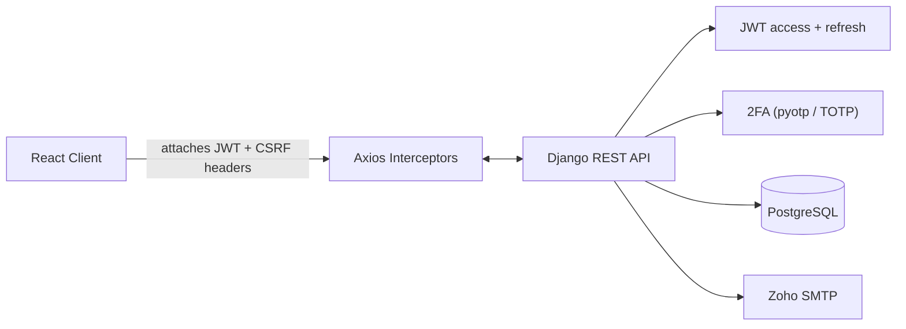
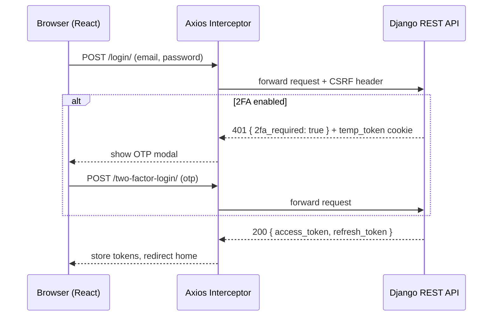
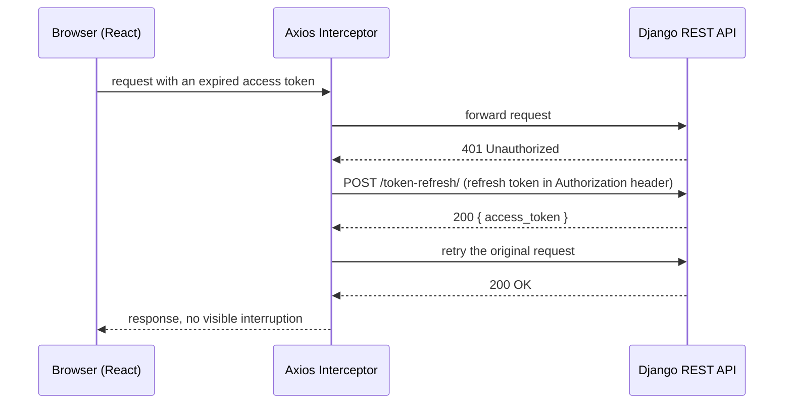

# Gait — the internal security system behind my apps


**[Live site → gaitobservatory.com](https://gaitobservatory.com/)**

Gait is the internal security system I built to protect my own applications. It is not a product for other companies. Gait was first built to secure Lumen, my clinical app, which is in development: it signs in through Gait with gait-sdk, and its security-check reporting is built but not yet running. In production today, Gait protects itself.

What it does: hardened identity (cookie sessions, refresh-token rotation with replay detection, two-step sign-in), strict workspace isolation, security checks that apps report with [gait-sdk](https://pypi.org/project/gait-sdk/) (public, MIT), findings that open on FAIL and close on PASS, and AI agents that investigate Gait's own problems and prepare fixes inside fixed boundaries, checked by an independent validator, with every production change approved by me.

This repo started as a working authentication system — not a mockup. Registration, login, TOTP-based two-factor auth, automatic token refresh, and a password-reset flow, all wired to a real Django REST API. Built to understand web security from the inside out: where auth actually breaks, and how modern systems close those gaps.

---

## What this is

This repo is the **React frontend**. It talks to a separate Django REST Framework API — [`django_auth`](https://github.com/anthonynarine/django_auth) — which issues and validates the JWTs, handles two-factor secrets, and sends transactional email via Zoho SMTP.

| | |
|---|---|
| **Frontend** | React 18, React Router, Axios, this repo |
| **Backend** | Django REST Framework, PyJWT, `pyotp` — [`django_auth`](https://github.com/anthonynarine/django_auth) |
| **Auth** | JWT access + refresh tokens, TOTP 2FA, CSRF-protected cookies |
| **Email** | Zoho SMTP (registration receipts, password reset links) |
| **Hosting** | Netlify (frontend) + Heroku (API) |

---

## Features

- **Registration & login** — email/password, passwords hashed server-side, never touched as plain text
- **Two-factor authentication** — QR-code TOTP setup via `pyotp`, verified with an authenticator app
- **JWT session handling** — short-lived (15 min) access tokens, longer-lived refresh tokens, both issued by the API
- **Automatic token refresh** — an Axios response interceptor catches an expired token, refreshes it, and retries the original request with no visible interruption
- **Password reset** — email-based, single-use, time-limited reset links
- **CSRF + cookie security** — CSRF tokens synced from every API response; `Secure`/`SameSite` cookie flags switch automatically between local development and production

---

## Architecture



`src/interceptors/axios.js` is the center of gravity on the frontend: every request passes through it to attach the current access token and CSRF header, and every response passes back through it to catch an expired token before it ever reaches a component.

### Login, step by step (2FA optional)



### Staying signed in



---

## Project structure

```
src/
├── components/
│   ├── home/            # Landing page: hero, flow diagrams, about
│   ├── login/            # Login form + OTP modal
│   ├── register/         # Registration form
│   ├── forgot-password/  # Request a reset link
│   ├── reset-password/   # Set a new password from the emailed link
│   ├── two-factor/       # QR-code 2FA setup
│   ├── mail/             # Contact form
│   ├── app-features/     # Demo pages (chat completion, request/response walkthrough)
│   ├── footer/
│   └── not-found/
│
├── context/auth/         # BasicAuthContext, TwoFactorAuthContext, UserSessionContext
├── hooks/                # useBasicAuth, useTwoFactorAuth, useUserSession, useGptRequest
├── interceptors/
│   └── axios.js           # Request/response interceptors — the auth nerve center
└── utils/toastUtils/
```

Each context is a thin wrapper around a same-named hook: the hook owns all state and API calls, the context just exposes it to the component tree.

---

## Getting started

```bash
cd react-auth
npm install

# create react-auth/.env — see Environment Variables below
npm start
```

Visit `http://localhost:3000`.

```bash
npm run build   # production build, output to react-auth/build/
```

### Environment variables

Create `react-auth/.env`:

```bash
REACT_APP_USE_PRODUCTION_API=false
REACT_APP_DEV_URL=http://127.0.0.1:8000/api
REACT_APP_PRODUCTION_URL=https://ant-django-auth-62cf01255868.herokuapp.com/api
```

`REACT_APP_USE_PRODUCTION_API=true` forces the frontend to talk to the deployed Heroku API even during local development — useful for testing against real data, but worth knowing it means `npm start` won't hit your local Django server.

---

## Related repositories

| Project | Description |
|---|---|
| [django_auth](https://github.com/anthonynarine/django_auth) | The Django REST Framework API this frontend talks to — JWT issuance, 2FA, password reset |
| [auth_integration](https://github.com/anthonynarine/auth_integration) | Reusable Django package other services use to validate `django_auth`'s tokens |
| [tic_tac_toe](https://github.com/anthonynarine/tic_tac_toe) | Real-time multiplayer game + chat, JWT-secured over WebSockets |
| [Lumen_Logger](https://github.com/anthonynarine/Lumen_Logger) | Structured logging library built alongside this ecosystem |

---

## Author

**Anthony Narine** — full-stack developer in Brooklyn.
[GitHub](https://github.com/anthonynarine) · [LinkedIn](https://www.linkedin.com/in/anthony-narine-9ab567245/)

© 2026 Anthony Narine. All rights reserved.
