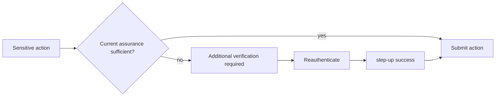

# Gait Security Observatory Frontend

React frontend for the Gait authentication surface and Security Observatory.

## What it does

- Handles login, guest login, 2FA, refresh coordination, logout, and session validation.
- Surfaces the staff-only Security Observatory.
- Supports generalized step-up authentication for sensitive account actions.
- Provides account security flows for password change and MFA lifecycle management.

## Step-up flow



## Security Observatory

The Observatory is read-only and staff-gated. It shows durable security and session activity from the backend, including:

- login success and failure
- refresh replay detection
- password change and recovery events
- MFA lifecycle events
- step-up success and failure
- abuse-control throttling and blocks

## Security Command — Specialist Investigation & AI Budget (B-UX4)

Security Command (`src/components/security-command/`) surfaces the backend's B-SPEC1/B-AI2 specialist-routing and AI-budget architecture. Every value described below is backend-computed telemetry or read-model state — none of it is derived, authorized, or invented in React.

- **AI Budget card** (`src/components/security/AiBudgetCountdown.jsx`, `src/hooks/useAiBudgetStatus.jsx`): reads `GET /api/security-agents/ai-budget/` and renders exactly what the backend already decided — remaining dollars (the largest figure), a usage progress bar, token/call/investigation counts, and a reset countdown. The frontend never computes a spend threshold; it only branches its *visual* treatment (quiet vs. elevated) on the backend's own `status` (`NORMAL`/`AUTO_PAUSED`/`EXHAUSTED`) and `requires_attention` fields. An API failure renders "AI budget unavailable," never a fabricated `$0` or `EXHAUSTED`.
- **Specialist assignment** (`SpecialistCard.jsx`): one reusable component for all six backend specialists (Identity/AppSec/Tenant-AuthZ/Abuse/Infrastructure/General). Specialization comes entirely from backend-supplied `specialist_display_name` — there is no per-specialist page and no client-side control/threat/domain-to-specialist mapping.
- **Commander routing provenance** (`CommanderRoutingPanel.jsx`): shows which specialist was assigned, the routing reason, the router version, and whether the general fallback was used — all read from `GET /api/security-agents/cases/<id>/investigation-summary/` (`security_agents.auto_investigation.get_case_auto_investigation_summary`). `specialistLabels.js` only translates backend enum values into text; it contains no routing logic of its own.
- **DiagnosisReport presentation** (`DiagnosisPanel.jsx`): reads the case's `human-review` packet (`GET /api/security/cases/<id>/human-review/`) for its `diagnosis` section and renders it clearly labeled **"AI Diagnosis — Advisory"**, visually distinct from Security Truth. Facts and hypotheses render as separate lists so a hypothesis is never mistaken for verified evidence; confidence is shown as the raw reported percentage, never bucketed into an invented category.
- **INVESTIGATION_BLOCKED** (`InvestigationBlockedNotice.jsx`): renders the backend's own safe reason category (`KILL_SWITCH`/`BUDGET_EXCEEDED`/`CAPABILITY_DENIED`/`EXECUTION_FAILED`) and recommended action. A budget-related block links to the Observatory's AI Budget card. There is no retry button anywhere in this flow — the frontend never bypasses backend budget or Gateway policy.
- **Hide noise, elevate risk**: `NORMAL`/healthy states render as quiet, unstyled panels; `AUTO_PAUSED`/`EXHAUSTED`/`INVESTIGATION_BLOCKED` render with visible attention styling. This mirrors the same principle already used for Security Posture.

**Why the frontend doesn't do more than this:**
- It doesn't route specialists — `specialist_routing.py` (control/threat/attack-surface/domain mapping) is backend-only; the frontend only ever displays the backend's routing *decision*, never recomputes one.
- It doesn't enforce the AI budget — `AiUsageLedger`/`check_ai_budget()` are the only code that ever allows or denies a real provider call. The frontend's `status`-based styling is presentation only.
- It never calls OpenAI (or any model provider) directly — every AI-derived value shown here (a `DiagnosisReport`, a specialist assignment, a budget figure) is read from an existing Django read-only endpoint; there is no browser-side LLM call anywhere in this codebase.

## Local setup

1. Install dependencies.
2. Configure the environment file.
3. Start the app.

```bash
npm install
npm start
```

## Useful scripts

```bash
npm test
npm run build
npm start
```

## Environment

The frontend expects the authenticated API base URL and related production settings to be provided through the existing environment variables used by the repo.

## Notes

- `403 STEP_UP_REQUIRED` opens the step-up workflow.
- Ordinary permission `403` responses stay as permission denied.
- The auth interceptor still treats `401` as session/auth transport handling and does not auto-refresh on step-up responses.

## Status

This frontend supports the A6 step-up UX and the staff Security Observatory workflow.
