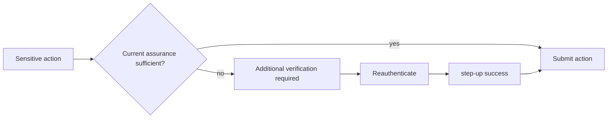

# Gait Security Observatory Frontend

React frontend for the Gait authentication surface and Security Observatory.

## What it does

- Handles login, guest login, 2FA, refresh coordination, logout, and session validation.
- Surfaces the staff-only Security Observatory.
- Supports generalized step-up authentication for sensitive account actions.
- Provides account security flows for password change and MFA lifecycle management.

## Step-up flow



## Security Observatory

The Observatory is read-only and staff-gated. It shows durable security and session activity from the backend, including:

- login success and failure
- refresh replay detection
- password change and recovery events
- MFA lifecycle events
- step-up success and failure
- abuse-control throttling and blocks

## Local setup

1. Install dependencies.
2. Configure the environment file.
3. Start the app.

```bash
npm install
npm start
```

## Useful scripts

```bash
npm test
npm run build
npm start
```

## Environment

The frontend expects the authenticated API base URL and related production settings to be provided through the existing environment variables used by the repo.

## Notes

- `403 STEP_UP_REQUIRED` opens the step-up workflow.
- Ordinary permission `403` responses stay as permission denied.
- The auth interceptor still treats `401` as session/auth transport handling and does not auto-refresh on step-up responses.

## Status

This frontend supports the A6 step-up UX and the staff Security Observatory workflow.
